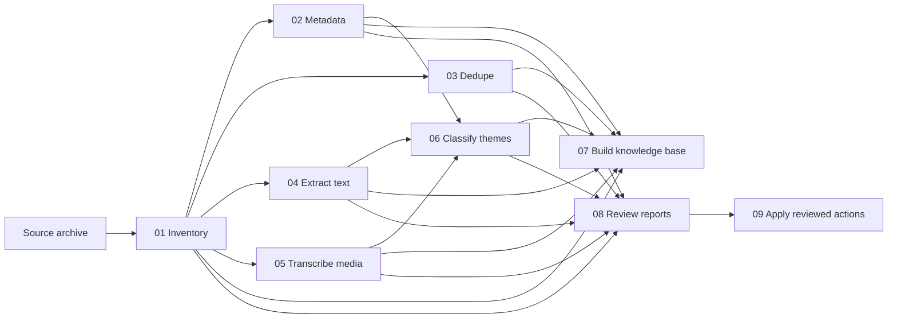

# Architecture

Comber is a staged pipeline. Each stage reads source files or previous-stage outputs, validates inputs, writes its own outputs, and exits with a clear code.

## State

The toolkit does not require a service or database server.

- CSV is used for reviewable tables.
- JSON sidecars are used where nested metadata is useful.
- Markdown is used for the final knowledge base.
- Logs capture operational details.
- ChromaDB (optional) is used for vector embeddings in semantic search.

## External Language Sidecars

Features requiring ML/NLP libraries are implemented as Python scripts in `scripts/python/`:

- `10_extract_entities.py` — NER using GLiNER2, reads classification.csv + extracted/transcripts markdown, writes entities.csv
- `11_semantic_search.py` — Vector search using sentence-transformers + ChromaDB, indexes vault notes and supports natural-language queries

These follow the same CLI conventions (--help, argument parsing) and read from the PS1 pipeline's CSV/markdown outputs.

## Trust Boundaries

- File inventory and hashes are deterministic.
- Duplicate candidates are recommendations until a human approves a manifest.
- Near-duplicate detection uses perceptual hashing (ImageMagick `identify`) or Czkawka CLI, both opt-in via `dedupe` config section.
- LLM outputs are treated as untrusted annotations.
- The reviewed-action script and cleanup script are the only scripts that may move or delete files.
